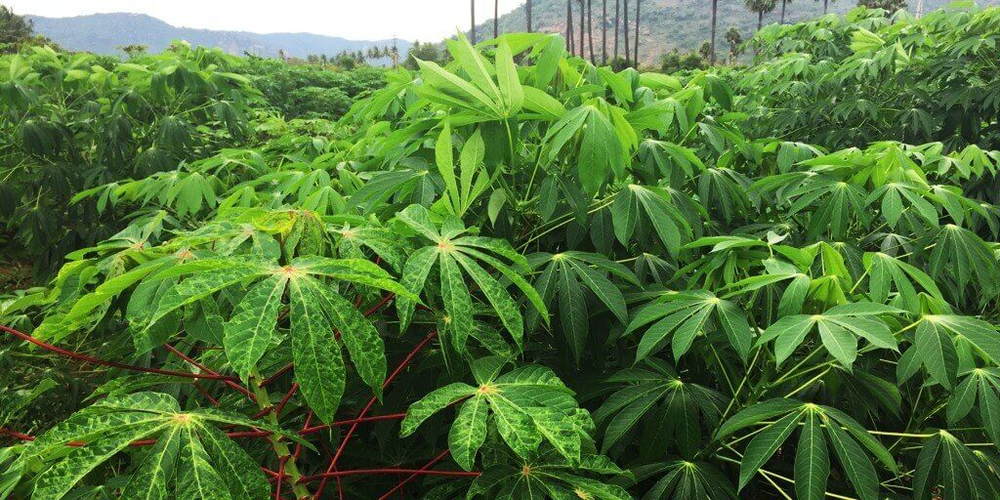

# cassava-leaf-disease-classification 

kaggle.com/competitions/cassava-leaf-disease-classification

Problem statement: Task is to classify each cassava image into four disease categories or a fifth category indicating a healthy leaf. With your help, farmers may be able to quickly identify diseased plants, potentially saving their crops before they inflict irreparable damage.

### Identify the type of disease present on a Cassava Leaf image
<picture>
 <source media="(prefers-color-scheme: dark)" srcset="imgs/cassava-leaf.jpeg">
 <source media="(prefers-color-scheme: light)" srcset="imgs/cassava-leaf.jpeg">
 
</picture>

As the second-largest provider of carbohydrates in Africa, cassava is a key food security crop grown by smallholder farmers because it can withstand harsh conditions. At least 80% of household farms in Sub-Saharan Africa grow this starchy root, but viral diseases are major sources of poor yields. With the help of data science, it may be possible to identify common diseases so they can be treated.

Existing methods of disease detection require farmers to solicit the help of government-funded agricultural experts to visually inspect and diagnose the plants. This suffers from being labor-intensive, low-supply and costly. As an added challenge, effective solutions for farmers must perform well under significant constraints, since African farmers may only have access to mobile-quality cameras with low-bandwidth.

In this competition, we are introduced to a dataset of 21,367 labeled images collected during a regular survey in Uganda. Most images were crowdsourced from farmers taking photos of their gardens, and annotated by experts at the National Crops Resources Research Institute (NaCRRI) in collaboration with the AI lab at Makerere University, Kampala. This is in a format that most realistically represents what farmers would need to diagnose in real life.

## Understanding the data and metrics: 

### Dataset desc
<picture>
 <source media="(prefers-color-scheme: dark)" srcset="imgs/dataset-desc.png">
 <source media="(prefers-color-scheme: light)" srcset="imgs/dataset-desc.png">
 
</picture>